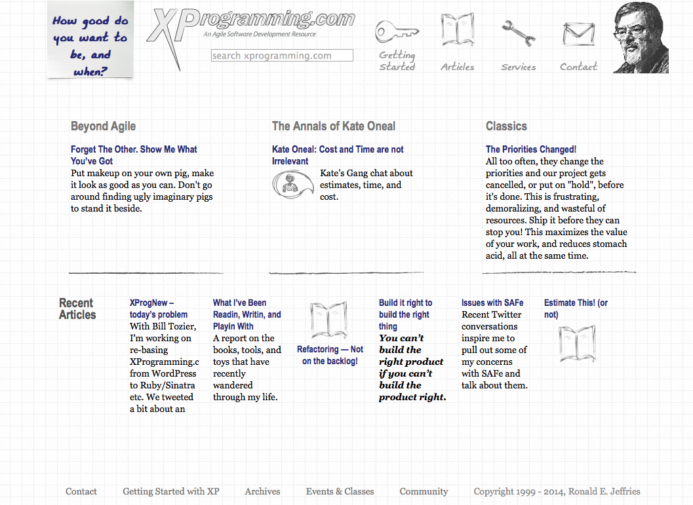
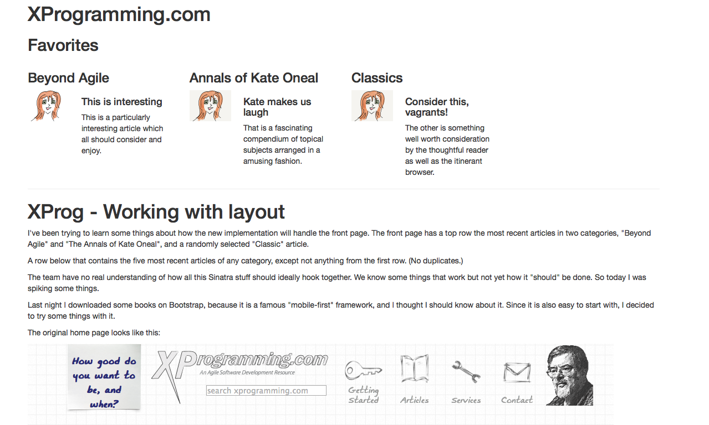
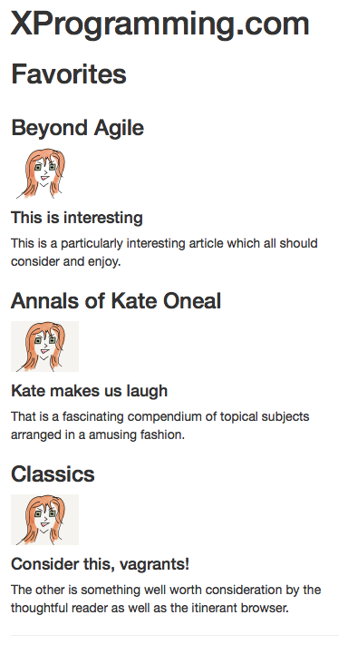

# XProg - Working with layout in the world where headers are really really long

I've been trying to learn some things about how the new implementation will handle the front page. The front page has a top row the most recent articles in two categories, "Beyond Agile" and "The Annals of Kate Oneal", and a randomly selected "Classic" article.

A row below that contains the five most recent articles of any category, except not anything from the first row. (No duplicates.)

The team have no real understanding of how all this Sinatra stuff should ideally hook together. We know some things that work but not yet how it "should" be done. So today I was spiking some things.

Last night I downloaded some books on Bootstrap, because it is a famous "mobile-first" framework, and I thought I should know about it. Since it is also easy to start with, I decided to try some things with it.

The original home page looks like this:

Thinking about the entities represented on that page, coming from the articles repository, we have a couple of collections of articles. For each one we need to have a picture, a title, and a precis. Each article needs to know those things, it seems to me, and deliver them to the page to be rendered.

We also have a "header" which is the bit that says "Beyond Agile" and so on. We could go one of at least two ways on that. We could have the header string in the HTML, or we could provide it as part of the article. It seems to me that selecting what will be in that top row is a decision, and one that is kind of a "site strategy". Rather than have the page be edited when this list changes, I am inclined to make the change in the model -- that is, in the code that supports the page and provides its content.

So my plan is that the "Article" will provide a header, a little picture (icon), a title, and a precis. I'm only part way there right now. The Ruby / Sinatra code looks like this:

    require 'sinatra/base'
    require 'kramdown'
    
    set :static, false

    class SinatraDemo < Sinatra::Base

    Article = Struct.new(:icon, :header, :title, :content)

    a1 = Article.new("katetrans.png", "Beyond Agile", \
                    "This is interesting", \
                    "This is a particularly interesting article which all should consider and enjoy.")
    a2 = Article.new("kate.png", "Annals of Kate Oneal", "Kate makes us laugh", \
                    "That is a fascinating compendium of topical subjects arranged in a amusing fashion.")
    a3 = Article.new("kate.png", "Classics", "Consider this, vagrants!", \
                    "The other is something well worth consideration by the thoughtful reader as well as the itinerant browser.")

      get '/' do
        actual_article = File.read(File.dirname(__FILE__) + "/articles/xprog-implementing-anew/XProgAnew.md")
        @article = markdown actual_article
        @fave = [a1, a2, a3]
        # this means that the erb has to know an array is coming.
        # could instead build up a longer HTML but the erb has a header in it
        
        erb :frontpage
        # what's returned here is what's displayed
      end

      get '/image/:img' do
        send_file File.join('articles/xprog-implementing-anew/', params[:img]), :type => 'image/jpeg', :disposition => 'inline'
      end
    end

What we have there, in addition to the Sinatra boiler plate, is a struct "Article" that contains the fields we need for display. They are all text at this point. It may be that we'll have markdown to worry about later. 

We define three articles with the image name of their "icon", header, title, and the precis (which is called "content") in the display above. Writing this, I realize I need a better name. Like precis. 

In our get, we're creating an actual_article by reading a file from one of the folders I'm using as a repository. For testing this article, I'll change that code to use this file. Further out, we'll have a list of articles, click on one, and display that page. Right now we're spiking to learn things.

We markdown the actual_article into a member variable called @article, and we create an array, @fave, containing our three Article structs. Then we render the frontpage with erb and see what comes out. Here's a look:

What we see here is that there are three articles at the top and they all have (almost) the same icon. (The first one's picture is transparent, the other two have a background. Note the difference in the Ruby code: one of them uses katetrans.png)

Now let's look at the template for this page, in the file frontpage.erb. It looks like this:

    <!DOCTYPE html>
    <html>
    <head>
        <meta charset="UTF-8">
        <meta http-equiv="X-UA-Compatible" content="IE-edge">
        <meta name="viewport" content="width=device-width, initial-scale=1">
        <link href="http://maxcdn.bootstrapcdn.com/bootstrap/3.2.0/css/bootstrap.min.css" rel="stylesheet">
        <title>XProg home page</title>
    </head>
    <body>
        

            

                <h1>XProgramming.com</h1>
                <h2>Favorites</h2>

                

                    <% @fave.each do |s| %>
                        

                            <h3><%= s.header %></h2>
                                

                                    

                                        " width="75px%"/>
                                    

                                    

                                        <h4><%= s.title %></h4>
                                        <%= s.content %>
                                    

                                

                        

                    <% end %>
                

            

        

        <!--
-->
        

            

            <%= @article %>
        

        

            

            
This is at the bottom of the page

        

    </body>
    </html>

Let me call out a few things of note. Up in the header, there are some meta lines and a link. I copied those directly from the book. I am not entirely clear what they do, and not very worried about it. There's a lot that I do (nearly) understand, so I'm happy about that. 

Down after that empty line, we have a div with class of "row", then a patch of code, embedded in script brackets, saying `@fave.each do | s |`. That's an embedded ruby statement opening a loop over the instance variable @fave. That this works tells us that somehow, this HTML page has access to our instance variables. It is as if it is part of our code: inside this erb file, self.class returns SinatraDemo, the name of the Ruby class shown above. I have no idea how this works. I'd like to know someday but for now it's just another magic incantation.

Reading on down that mixture of Ruby and HTML, we see that inside the row, we are looping for each item @fave, each one with header, title, and content. Each one is inside a div with class "col-lg-3 col-md-4" and so on. This is the Bootstrap CSS magic to make the columns that we see in the picture above, where the little Kate pictures are. If I resize the browser window, the CSS makes things like up differently until finally, if it's narrow enough, it goes down to one column like the picture to the right (or below if you're on a narrow screen).

Pretty sweet, if you ask me.

{: style="border:2px solid black" width="300"}

## One more thing (Columbo)

Note that `get '/image/:img do` down toward the bottom of the Ruby code. What's that about? Well, that's the code for the problem mentioned in another article, up on my real web site, about displaying images. I want the images with the article. The current design is that every article should be in its own folder, with its images, and its metadata. That would make it convenient to edit articles and to pack them up. And it would mean that in Markdown indicating an image will be as simple as possible: `!()[foo.png]`. 

Rackup and Sinatra, in our infrastructure, assume that images will be in the "public" folder. They also want to be sure people can't go browsing around outside the public folder. So there is folderol and rigmarole going on to ensure that no URL can be served from outside that folder. Somehow they're controlling what folders you can access, and no amount of dot-dotting and the like will get you out. Security is a good thing, we're down with that.

So I tweeted for help on this topic, and put a little article on XProgramming, and Cory Foy, among others, went to the trouble of demonstrating a way to do it. Our version of that, right now, is that the image is shown as `!()[image/foo.png]` in the Markdown, and the code in that get is tricking Sinatra into serving the picture in line. 

That won't do long term. In particular, we don't know right now what the folder is for that particular picture, so the folder name is in there literally. (That's true in the main get as well.) That will get sorted out in the future, and we'll probably wind up putting all the article folders under public as part of that.

Anyway, that's what's going on there ...

## Summing up and it's about time if you ask me

What we have here is a spike of a moderately complicated story. In that spike we have learned a lot:

* Experimenting with Bootstrap CSS suggests that it's pretty easy to get a mobile-first design that's responsive.
* Experimenting with communication between the template and the Ruby code shows that we can share information with member variables and we can process fairly complex objects and collections.
* We see that writing Ruby in line looks weird. We also found that it's very fiddly.
* An "Article" class is probably emerging. Right now it's just a Struct, but I can feel behavior right around the corner. 
* Our assumed folder design conflicts with Rackup and Sinatra a bit. 
* None of this looks right, yet all of it works pretty well.

This is the nature of spikes. We get everything connected up. Having learned one way to do things, we're past "impossible" and into finding better ways. 

Bill and I will figure out next steps on Monday. Some candidate ideas are:

* Get this stuff into a shared repository. Currently he and I are working separately on separate code all the way down.
* See about pushing this to a public site (Heroku?) so that you can follow along.
* Decide where to put articles and images.
* Get the index page producing real lists of articles not made up ones.
* Work out ways to let multiple gets on a page know where we're coming from so they can plug in the right folders as needed.
* ... and surely much more.

So far so good. Thanks for coming along. Write me an email if you have a helpful idea.
